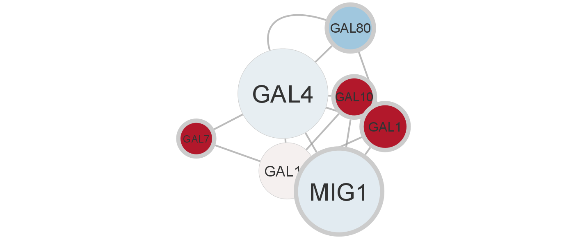
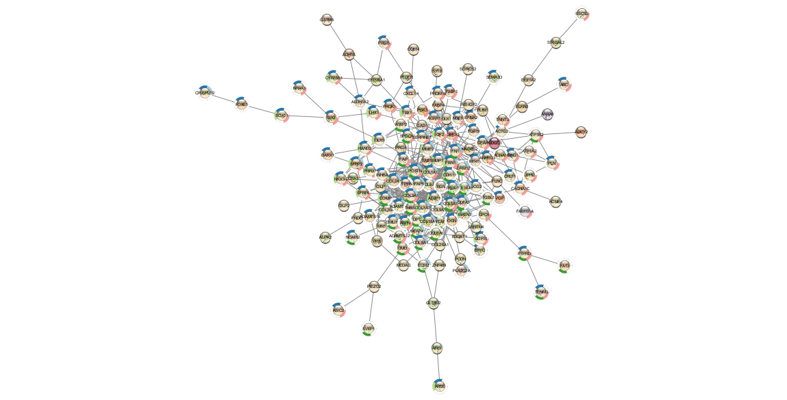
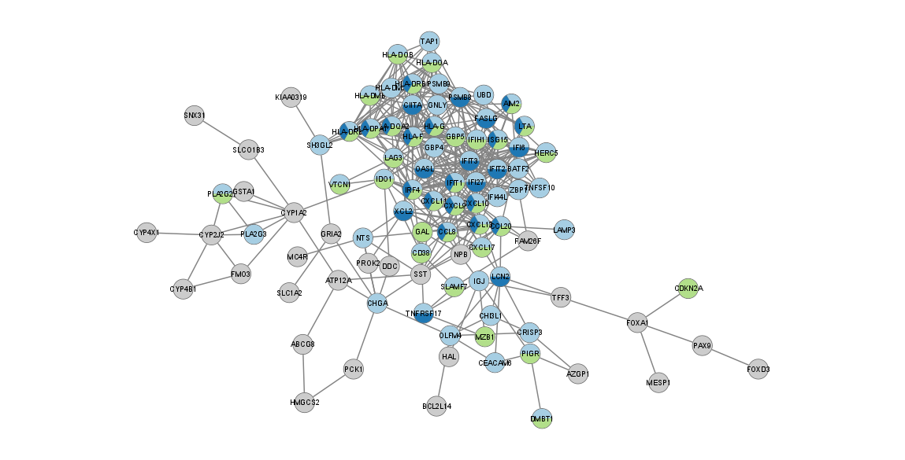
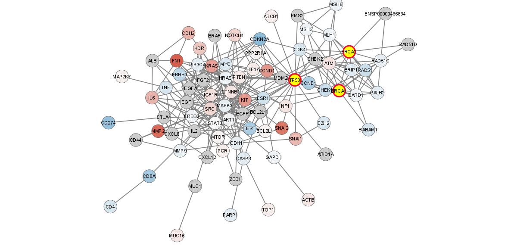
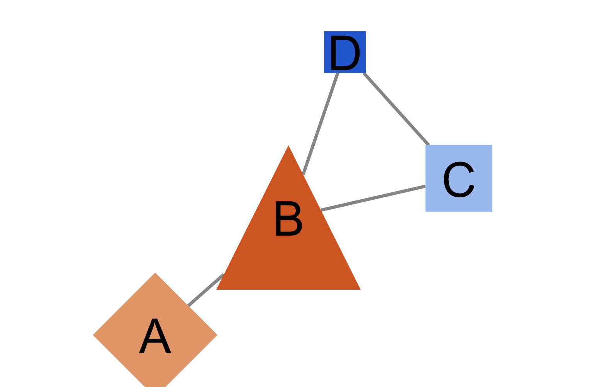

## Creating Pretty Documents from R Markdown]
Way back in Lab 2 there was a link to [Creating Pretty Documents from R Markdown](https://prettydoc.statr.me/)

First install the prettydoc package

Then in the 'yaml block at the top of your Rmd file

```{r, eval = FALSE}
output:
  prettydoc::html_pretty:
    theme: cayman
    highlight: github
```

## How to create a simple website with RMarkdown
Also in Lab 2 was a link on [How to create a simple website with RMarkdown](https://nceas.github.io/training-rmarkdown-website/tutorial.html). To test this out and not destroy your current GitHub Page with the labs, first create a new repo (e.g. MyWebSite). Remember to enable the Git Page under Settings and change the folder from root to docs. Create a local repository. Then create your new website inside the local repository. Here is an example of my [WebSiteTest](https://jeffreyblanchard.github.io/WebSiteTest/)

## Exercises

Follow is my website:

[Billy's Website](docs/docs/index.html)


## Introduction to Network Analysis
Cytoscape is a popular tool for network analysis. It has been in developed for over 20 years and now has a robust ecosystem with many plugins/apps to for specific uses. Their is a detail user manual (which can be edited on github) and tutorials.

Within R there are several alternative graph visualization packages including igraph and the Bioconductor package graph. Both are excellent packages however this past year a new R interface to Cytocape Rcy3 was released which we will explore today. Here is the initial publication describing Rcy3.

## On the Computer

### Cytoscape

  Download, install and open Cytoscape
  
  Read through the [Tour of Cytoscape](https://cytoscape.org/cytoscape-tutorials/protocols/tour-of-cytoscape/#/)
  
  Do the recommended exercises on Basic Data Visualization and Differentially Expressed Genes

Basic_Data_Visualization



Differentially_Expressed_Genes_STRING_Protein_Query




Differentially_Expressed_Genes_STRING_Disease_Query



### RCy3

Go through the first vignette [Overview of RCy3](https://bioconductor.org/packages/release/bioc/html/RCy3.html)

#### Getting started

First, launch Cytoscape and keep it running whenever using RCy3. Confirm that you have everything installed and running:
```{r, eval = FALSE}
if (!requireNamespace("BiocManager", quietly = TRUE))
    install.packages("BiocManager")
BiocManager::install("RCy3")
```

```{r, eval = FALSE}
library(RCy3)
```

Before this step, you need to start software Cytoscape
```{r, eval = FALSE}
cytoscapePing ()
cytoscapeVersionInfo ()
```

#### My first network

Let’s create a Cytoscape network from some basic R objects

```{r, eval = FALSE}
nodes <- data.frame(id=c("node 0","node 1","node 2","node 3"),
           group=c("A","A","B","B"), # categorical strings
           score=as.integer(c(20,10,15,5)), # integers
           stringsAsFactors=FALSE)
edges <- data.frame(source=c("node 0","node 0","node 0","node 2"),
           target=c("node 1","node 2","node 3","node 3"),
           interaction=c("inhibits","interacts","activates","interacts"),  # optional
           weight=c(5.1,3.0,5.2,9.9), # numeric
           stringsAsFactors=FALSE)

createNetworkFromDataFrames(nodes,edges, title="my first network", collection="DataFrame Example")
```

#### Switch styles

```{r, eval = FALSE}
setVisualStyle('Marquee')
```

#### My own style

```{r, eval = FALSE}
style.name = "myStyle"
defaults <- list(NODE_SHAPE="diamond",
                   NODE_SIZE=30,
                   EDGE_TRANSPARENCY=120,
                   NODE_LABEL_POSITION="W,E,c,0.00,0.00")
nodeLabels <- mapVisualProperty('node label','id','p')
nodeFills <- mapVisualProperty('node fill color','group','d',c("A","B"), c("#FF9900","#66AAAA"))
arrowShapes <- mapVisualProperty('Edge Target Arrow Shape','interaction','d',c("activates","inhibits","interacts"),c("Arrow","T","None"))
edgeWidth <- mapVisualProperty('edge width','weight','p')
  
createVisualStyle(style.name, defaults, list(nodeLabels,nodeFills,arrowShapes,edgeWidth))
setVisualStyle(style.name)
```

Pro-tip: if you want to set NODE_WIDTH and NODE_HEIGHT independently, you also need to unlock the node dimensions with…

```{r, eval = FALSE}
lockNodeDimensions(FALSE, style.name)
```

#### Bioconductor graph example

Alternatively, you might want to start from a Bioconductor graphNEL object. Here we create a 4-node graph in R, send it to Cytoscape for display and layout. For the sake of simplicity, no node attributes and no visual styles are included; those topics are covered in subsequent steps.

```{r, eval = FALSE}
g = new ('graphNEL', edgemode='directed')
g = graph::addNode ('A', g)
g = graph::addNode ('D', g)
g = graph::addNode ('C', g, edges = list('D'))
g = graph::addNode ('B', g, edges = list(c('A','D','C')))
createNetworkFromGraph (g, title='simple network', collection='GraphNEL Example')
```

You should now have the structure of this 4-node graph with a basic, default style. Fortunately, Cytoscape has some built-in rendering rules in which (and unless instructed otherwise) nodes and edges are rendered and a default (user-preference) layout algorithm is applied.

#### Add node attributes

We often know quite a lot about the nodes and edges in our graphs. By conveying this information visually, the graph will be easier to explore. For instance, we may know that protein A phosphorylates protein B, that A is a kinase and B a transcription factor, and that their mRNA expression (compared to a control) is a log2 fold change of 1.8 and 3.2 respectively. One of the core features of Cytoscape is visual styles, which allow you to specify how data values (e.g., kinase',transcription factor’; expression ratios) should be conveyed in the visual properties of the graph (e.g., node shape, node color or size).

We continue with the simple 4-node graph, adding two kinds data values (moleculeType' andlog2fc’). The easiest way to do this is via data.frames. However, you can also include attributes together with the original graph models as Bioconductor graphs, igraphs or data.frames and then use the provided create functions to create and load in a single step (see createNetworkFromGraph, createNetworkFromIgraph and createNetworkFromDataFrames functions). Check out the other vignettes for more exampls.

```{r, eval = FALSE}
df <- data.frame (moleculeType=c('kinase','TF','cytokine','cytokine'),
                       log2fc=c(1.8,3.0,-1.2,-2.5),
                       row.names = c('A','B','C','D'), # row.names = node names
                       stringsAsFactors = FALSE)       # important when loading strings!
loadTableData (df)
```

Note that adding the attributes does not in itself cause the appearance of the graph to change. Such a change requires that you specify and apply visual style mappings, which will be explained in the next section. You can, however, examine these attributes in Cytoscape, using Cytoscape’s the Data Panel to display data values associated with selected nodes immediately below the Cytoscape window.

#### Modifying the display: defaults and mappings

RCy3 provides an easy way to not only change the default styles, but more interestingly, RCy3 also provides easy access to mapping your data to visual styles, e.g., allowing the size, shape and color of nodes and edges to be determined by the data you have associated with those nodes and edges.

First, let’s change the the defaults.

```{r, eval = FALSE}
setNodeShapeDefault ('OCTAGON')
setNodeColorDefault ('#AAFF88')
setNodeSizeDefault  (60)
setNodeFontSizeDefault (30)
```

Now we will add some visual mappings. Let’s map `moleculeType’ to node shapes. First, we can see which shapes are available in Cytoscape, then we can define the mapping with paired lists

```{r, eval = FALSE}
getNodeShapes ()   # diamond, ellipse, trapezoid, triangle, etc.
column <- 'moleculeType'
values <- c ('kinase',  'TF','cytokine')
shapes <- c ('DIAMOND', 'TRIANGLE', 'RECTANGLE')
setNodeShapeMapping (column, values, shapes)
```

The node shape mapping is an example of a discrete mapping, where a style is defined for each, discrete value. This is useful for categorical data (like type) where there is only a limited set of possible values. This is in contast to the other two other types of mappings: continuous and passthrough. In the case of expression values, for example, we will want to use continuous mapping (e.g., to node color), defining a small set of control points, rather than an explicit color for each possible data value. Cytoscape will simply interpolate between the control points to provide a gradient of colors. Let’s try that one now

```{r, eval = FALSE}
column <- 'log2fc'
control.points <- c (-3.0, 0.0, 3.0)
colors <-  c ('#5588DD', '#FFFFFF', '#DD8855')
setNodeColorMapping (column, control.points, colors)
```

Note that there are three colors and three control points. However, you can also specify two additional colors beyond the number of control points if you want to set extreme (or out-of-bounds) colors for values less than or greater than your control points.

```{r, eval = FALSE}
control.points <- c (-2.0, 0.0, 2.0)
colors <-  c ('#2255CC', '#5588DD', '#FFFFFF', '#DD8855','#CC5522')
setNodeColorMapping (column, control.points, colors)
```

Now, add a node size rule, using log2fc again as controlling node values.

```{r, eval = FALSE}
control.points = c (-3.0, 2.0, 3.0)
sizes = c (20, 80, 90)
setNodeSizeMapping (column, control.points, sizes)
```

If you recall the third type of mapping, passthrough, we can see it already working in our current network example. The node labels! By default, the name column is mapped to the node label property using passthrough logic: the value is passed directly to the style property.

#### Selecting nodes

Let us now try selecting nodes in Cytoscape from R. Select the C node by name:

```{r, eval = FALSE}
selectNodes ('C','name')
getSelectedNodes ()
```

Now we wish to extend the selected nodes to include the first neighbors of the already-selected node B. This is a common operation: for instance, after selecting one or more nodes based on experimental data or annotation, you may want to explore these in the context of interaction partners (in a protein-protein network) or in relation to upstream and downstream partners in a signaling or metabolic network. Type:

```{r, eval = FALSE}
selectFirstNeighbors ()
```

You will see that three nodes are now selected. Get their names back to R as a list:

```{r, eval = FALSE}
node.names <- getSelectedNodes ()
```

And, finally, deselection works as you’d expect by means of a general clearSelection function:

```{r, eval = FALSE}
clearSelection()
```

#### Saving and export

Session files save everything. As with most project software, we recommend saving often!

```{r, eval = FALSE}
saveSession('image/vignette_session')
```

Note: If you don’t specify a complete path, the files will be saved relative to your current working directory in R.

#### Saving high resolution image files

You can export extremely high resolution images, including vector graphic formats.

```{r, eval = FALSE}
full.path=paste(getwd(),'image/vignette_image',sep='/')
exportImage(full.path, 'PNG', zoom=200) #.png scaled by 200%
exportImage(full.path, 'PDF') #.pdf
```



#### Browse available functions, commands and arguments

RCy3 functions

```{r, eval = FALSE}
#help(package=RCy3)
```

Open swagger docs for live instances of CyREST API and Commands API:

```{r, eval = FALSE}
#cyrestAPI()  # CyREST API
#commandsAPI()  # Commands API
```

List available commands and arguments in R. Use “help” to list top level:

```{r, eval = FALSE}
commandsHelp("help")
```

List network commands. Note that “help” is optional:

```{r, eval = FALSE}
commandsHelp("help network")
```

List arguments for the network select command:

```{r, eval = FALSE}
commandsHelp("help network select")
```

That covers the basics of network manipulation. Check out the other vignettes for additional amd more complex examples. And when you are ready to work with some real data, check out the other basic and advanced R tutorials, https://github.com/cytoscape/cytoscape-automation/tree/master/for-scripters/R.

#### More examples

Don’t forget to check out the other vignettes in this package:

```{r, eval = FALSE}
#browseVignettes("RCy3")
```

In addition, the Cytoscape team is collecting scripts from the community in a public GitHub repository at https://github.com/cytoscape/cytoscape-automation/tree/master/for-scripters/R.
#### Development

The RCy3 project code and documentation is maintained at GitHub: https://github.com/cytoscape/RCy3. All bugs and feature requests are tracked as Issues, https://github.com/cytoscape/RCy3/issues.
