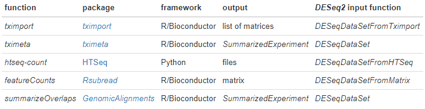

RNA-seq workflow: gene-level exploratory analysis and differential expression
https://master.bioconductor.org/packages/release/workflows/vignettes/rnaseqGene/inst/doc/rnaseqGene.html
R-script:
https://master.bioconductor.org/packages/release/workflows/html/rnaseqGene.html

## 1. Introduction

Bioconductor has many packages which support analysis of high-throughput sequence data, including RNA sequencing (RNA-seq). The packages which we will use in this workflow include core packages maintained by the Bioconductor core team for working with gene annotations (gene and transcript locations in the genome, as well as gene ID lookup). We will also use contributed packages for statistical analysis and visualization of sequencing data. Through scheduled releases every 6 months, the Bioconductor project ensures that all the packages within a release will work together in harmony (hence the “conductor” metaphor). The packages used in this workflow are loaded with the library function and can be installed by following the Bioconductor package installation instructions.

1. A published version of this workflow, including reviewer reports and comments is available at F1000Research. The version you are reading now differs from this one, primarily in that we now give code for performing fast transcript quantification followed by import in R/Bioconductor to perform gene-level analysis.
2. Another Bioconductor workflow covering differential transcript usage (DTU) is the rnaseqDTU workflow, with the published version likewise available at F1000Research.
3. If you have questions about this workflow or any Bioconductor software, please post these to the Bioconductor support site. If the questions concern a specific package, you can tag the post with the name of the package, or for general questions about the workflow, tag the post with rnaseqgene. Note the posting guide for crafting an optimal question for the support site.

### 1.1 Experimental data

The data used in this workflow is stored in the airway package that summarizes an RNA-seq experiment wherein airway smooth muscle cells were treated with dexamethasone, a synthetic glucocorticoid steroid with anti-inflammatory effects (Himes et al. 2014). Glucocorticoids are used, for example, by people with asthma to reduce inflammation of the airways. In the experiment, four primary human airway smooth muscle cell lines were treated with 1 micromolar dexamethasone for 18 hours. For each of the four cell lines, we have a treated and an untreated sample. For more description of the experiment see the PubMed entry 24926665 and for raw data see the GEO entry GSE52778.

## 2. Preparing quantification input to DESeq2

As input, the count-based statistical methods, such as DESeq2 (Love, Huber, and Anders 2014), edgeR (Robinson, McCarthy, and Smyth 2009), limma with the voom method (Law et al. 2014), DSS (Wu, Wang, and Wu 2013), EBSeq (Leng et al. 2013) and baySeq (Hardcastle and Kelly 2010), expect input data as obtained, e.g., from RNA-seq or another high-throughput sequencing experiment, in the form of a matrix of un-normalized counts. The value in the i-th row and the j-th column of the matrix tells how many reads (or fragments, for paired-end RNA-seq) can be assigned to gene i in sample j. Analogously, for other types of assays, the rows of the matrix might correspond e.g., to binding regions (with ChIP-Seq), or peptide sequences (with quantitative mass spectrometry).

The values in the matrix should be counts or estimated counts of sequencing reads/fragments. This is important for DESeq2’s statistical model to hold, as only counts allow assessing the measurement precision correctly. It is important to never provide counts that were pre-normalized for sequencing depth/library size, as the statistical model is most powerful when applied to un-normalized counts, and is designed to account for library size differences internally.

### 2.1 Transcript quantification and tximport / tximeta

A previous version of this workflow (including the published version) demonstrated how to align reads to the genome and then count the number of reads that are consistent with gene models. We now recommend a faster, alternative pipeline to genome alignment and read counting. This workflow will demonstrate how to import transcript-level quantification data, aggregating to the gene-level with tximport or tximeta. Transcript quantification methods such as Salmon (Patro et al. 2017), kallisto (Bray et al. 2016), or RSEM (Li and Dewey 2011) perform mapping or alignment of reads to reference transcripts, outputting estimated counts per transcript as well as effective transcript lengths which summarize bias effects. After running one of these tools, the tximport (Soneson, Love, and Robinson 2015) or tximeta (Love et al. 2020) packages can be used to assemble estimated count and offset matrices for use with Bioconductor differential gene expression packages, as will be demonstrated below.

A tutorial on how to use the Salmon software for quantifying transcript abundance can be found here. We recommend using the --gcBias flag which estimates a correction factor for systematic biases commonly present in RNA-seq data (Love, Hogenesch, and Irizarry 2016; Patro et al. 2017), unless you are certain that your data do not contain such bias.

The advantages of using the transcript abundance quantifiers in conjunction with tximport/tximeta to produce gene-level count matrices and normalizing offsets, are: (1) this approach corrects for any potential changes in gene length across samples (e.g. from differential isoform usage) (Trapnell et al. 2013); (2) some of these methods are substantially faster and require less memory and disk usage compared to alignment-based methods; and (3) it is possible to avoid discarding those fragments that can align to multiple genes with homologous sequence (Robert and Watson 2015). Note that transcript abundance quantifiers skip the generation of large files which store read alignments, instead producing smaller files which store estimated abundances, counts, and effective lengths per transcript. For more details, see the manuscript describing this approach (Soneson, Love, and Robinson 2015), and the tximport package vignette for software details.

tximeta (Love et al. 2020) extends tximport, offering the same functionality, plus the additional benefit of automatic addition of annotation metadata for commonly used transcriptomes (GENCODE, Ensembl, RefSeq for human and mouse). See the tximeta vignette package vignette for more details. tximeta produces a SummarizedExperiment that can be loaded easily into DESeq2 using the DESeqDataSet function, which will be demonstrated below. We will also discuss the various possible inputs into DESeq2, whether using tximport, tximeta, htseq (Anders, Pyl, and Huber 2015), or a pre-computed count matrix.

### 2.2 Quantifying with Salmon

As mentioned above, a short tutorial on how to use Salmon can be found here, so instead we will provide the code that was used to quantify the files used in this workflow. Salmon can be conveniently run on a cluster using the Snakemake workflow management system (Köster and Rahmann 2012).

The following Snakemake file was used to quantify the eight samples that were downloaded from the SRA (the SRR identifier is the run identifier, and there was only one run per sample for these eight samples).

DATASETS = ["SRR1039508",
            "SRR1039509",
            "SRR1039512",
            "SRR1039513",
            "SRR1039516",
            "SRR1039517",
            "SRR1039520",
            "SRR1039521"]

SALMON = "/path/to/salmon_0.14.1/bin/salmon"

rule all:
  input: expand("quants/{dataset}/quant.sf", dataset=DATASETS)

rule salmon_quant:
    input:
        r1 = "fastq/{sample}_1.fastq.gz",
        r2 = "fastq/{sample}_2.fastq.gz",
        index = "/path/to/gencode.v29_salmon_0.14.1"
    output:
        "quants/{sample}/quant.sf"
    params:
        dir = "quants/{sample}"
    shell:
        "{SALMON} quant -i {input.index} -l A -p 6 --validateMappings \
         --gcBias --numGibbsSamples 20 -o {params.dir} \
         -1 {input.r1} -2 {input.r2}"
         
The last line is the key one which runs Salmon. It says to quantify using a specific index, with automatic library type detection, using 6 threads, with the validate mappings setting (this is default in versions of Salmon ≥ 0.99), with GC bias correction, and writing out 20 Gibbs samples (this is optional). The last three arguments specify the output directory and the two paired read files.

The above Snakemake file requires that an index be created at /path/to/gencode.vVV_salmon_X.Y.Z, where VV and X,Y,Z should help specify the release of the reference transcripts and of Salmon. For human and mouse reference transcripts, we recommend to use GENCODE (Frankish et al. 2018).

The Salmon index can be created easily with the following command:

salmon index -t transcripts.fa.gz -i name_of_index

If the transcripts are downloaded from GENCODE, it is recommended to use something similar to the following command (which simply helps to strip the extra information from the transcript names):

salmon index --gencode -t gencode.v29.transcripts.fa.gz \
  -i gencode.v29_salmon_X.Y.Z
  
The above Snakemake file can then be used to execute Snakemake in various ways, including submitting multiple jobs to a compute cluster or in the cloud. The above Snakemake file was executed on a cluster with SLURM scheduling, with the following line in a separate job submitted to the cluster:

snakemake -j 4 --latency-wait 30 --cluster "sbatch -N 1 -n 6"

### 2.3 Reading in data with tximeta

Later in the workflow, we will load an object that contains the quantification data at the gene-level for all eight samples. However, the airway package also contains two quantification directories output by Salmon, in order to demonstrate reading this data into R/Bioconductor. In order to make the data package smaller, the quant.sf files in the quantification directories have been gzipped, so below where you see quant.sf.gz, you would probably use quant.sf on your own machine.

After we demonstrate importing with tximeta, we will load the full count matrix corresponding to all samples and all data, which is already provided in the same package, and will continue the analysis with that full data object.


```{r, eval = FALSE}
if (!requireNamespace("BiocManager", quietly = TRUE))
    install.packages("BiocManager")
BiocManager::install(version = "3.11")

```


```{r, eval = FALSE}
if (!requireNamespace("BiocManager", quietly = TRUE))
    install.packages("BiocManager")

BiocManager::install("rnaseqGene")

# I also needed to install the following on my computer 
# (You will realize this if you get an error message that the corresponding library will not load)

BiocManager::install("airway")
BiocManager::install("tximeta")
BiocManager::install("DESeq2")
BiocManager::install("Gviz")
BiocManager::install("sva")
BiocManager::install("RUVSeq")
BiocManager::install("fission")
```

We first load the data package with the example data:

```{r, echo=FALSE, message=FALSE, warning=FALSE, results="asis"}
library("BiocStyle")
library("knitr")
library("rmarkdown")
opts_chunk$set(message = FALSE, error = FALSE, warning = FALSE,
               cache = FALSE, fig.width = 5, fig.height = 5)
```

```{r}
library("airway")
```

The R function system.file can be used to find out where on your computer the files from a package have been installed. Here we ask for the full path to the extdata directory, where R packages store external data, that is part of the airway package.

```{r}
dir <- system.file("extdata", package="airway", mustWork=TRUE)
```

In this directory, we find a number of files, including eight BAM files that were used in the previous version of this workflow demonstrating alignment and counting. We will focus on the two directories that are in the quants directory, which contain the output from Salmon on two files.

```{r}
list.files(dir)
```
```{r}
list.files(file.path(dir, "quants"))
```

Typically, we have a table with detailed information for each of our samples that links samples to the associated FASTQ and Salmon directories. For your own project, you might create such a comma-separated value (CSV) file using a text editor or spreadsheet software such as Excel.

We load such a CSV file with read.csv:

```{r}
csvfile <- file.path(dir, "sample_table.csv")
coldata <- read.csv(csvfile, row.names=1, stringsAsFactors=FALSE)
coldata
```

To demonstrate loading Salmon quantifiation data into R, we will just work with the two samples that are provided in the airway package. We create a column called names and a column called files:

```{r}
coldata <- coldata[1:2,]
coldata$names <- coldata$Run
coldata$files <- file.path(dir, "quants", coldata$names, "quant.sf.gz")
file.exists(coldata$files)
```

Now we load the tximeta package and run its main function:

```{r, message=TRUE}
library("tximeta")
se <- tximeta(coldata)
```

If the reference transcriptome checksum was recognized by tximeta (details on this in the tximeta vignette), and if we have a working internet connection, tximeta will locate and download the relevant annotation data from various sources. A few details: the annotation data is only downloaded and parsed once, subsequently it will used locally cached versions of the metadata as needed (if you load data a second time that was quantified against the same reference transcripts). Also, the very first time that one uses tximeta, it will ask you to approve the default cache location (following the paradigm of the cache location used by other R and Bioconductor packages). You can change this location at any point later.

We will discuss what is the structure of the se object in the next section, but we can first just consider the dimensions. Note that tximeta imports data at the transcript level.

```{r}
dim(se)
head(rownames(se))
```

As this workflow is concerned with gene-level analysis, we will now summarize the transcript-level quantifications to the gene level (which internally makes use of the methods in tximport (Soneson, Love, and Robinson 2015)). The correct transcript-to-gene mapping table is automatically created based on the metadata stored within the se object.

```{r, message=TRUE}
gse <- summarizeToGene(se)

```

Now we can check that the dimensions are reduced and the row IDs are now gene IDs:

```{r}
dim(gse)
head(rownames(gse))
```

### 2.4 DESeq2 import functions

While the above section described use of Salmon and tximeta, there are many possible inputs to DESeq2, each of which have their own dedicated import functions. The following tools can be used generate or compile count data for use with DESeq2: tximport (Soneson, Love, and Robinson 2015), tximeta (Love et al. 2020), htseq-count (Anders, Pyl, and Huber 2015), featureCounts (Liao, Smyth, and Shi 2014), summarizeOverlaps (Lawrence et al. 2013).



We will next describe the class of object created by tximeta which was saved above as se and gse, and how to create a DESeqDataSet object from this for use with DESeq2 (the other functions above also create a DESeqDataSet).

### 2.5 SummarizedExperiment

```{r, echo=FALSE}
par(mar=c(0,0,0,0))
plot(1,1,xlim=c(0,100),ylim=c(0,100),bty="n",
     type="n",xlab="",ylab="",xaxt="n",yaxt="n")
polygon(c(45,90,90,45),c(5,5,70,70),col="pink",border=NA)
polygon(c(45,90,90,45),c(68,68,70,70),col="pink3",border=NA)
text(67.5,40,"assay(s)")
text(67.5,35,'e.g. "counts", ...')
polygon(c(10,40,40,10),c(5,5,70,70),col="skyblue",border=NA)
polygon(c(10,40,40,10),c(68,68,70,70),col="skyblue3",border=NA)
text(25,40,"rowRanges")
polygon(c(45,90,90,45),c(75,75,95,95),col="palegreen",border=NA)
polygon(c(45,47,47,45),c(75,75,95,95),col="palegreen3",border=NA)
text(67.5,85,"colData")
```

The component parts of a SummarizedExperiment object. The assay (pink block) contains the matrix of counts, the rowRanges (blue block) contains information about the genomic ranges and the colData (green block) contains information about the samples. The highlighted line in each block represents the first row (note that the first row of colData lines up with the first column of the assay).

The SummarizedExperiment container is diagrammed in the Figure above and discussed in the latest Bioconductor paper (Huber et al. 2015). In our case, tximeta has created an object gse with three matrices: “counts” - the estimated fragment counts for each gene and sample, “abundance” - the estimated transcript abundances in TPM, and “length” - the effective gene lengths which include changes in length due to biases as well as due to transcript usage. The names of the assays can be examined with assayNames, and the assays themselves are stored as assays (a list of matrices). The first matrix in the list can be pulled out via assay. The rowRanges for our object is the GRanges of the genes (from the left-most position of all the transcripts to the right-most position of all the transcripts). The component parts of the SummarizedExperiment are accessed with an R function of the same name: assay (or assays), rowRanges and colData.

We now will load the full count matrix corresponding to all samples and all data, which is provided in the airway package, and will continue the analysis with the full data object. We can investigate this SummarizedExperiment object by looking at the matrices in the assays slot, the phenotypic data about the samples in colData slot, and the data about the genes in the rowRanges slot.

```{r}
data(gse)
gse
```

The counts are the first matrix, so we can examine them with just assay:

```{r}
assayNames(gse)
```
```{r}
head(assay(gse), 3)
```

```{r}
colSums(assay(gse))
```

The rowRanges, when printed, shows the ranges for the first five and last five genes:

```{r}
rowRanges(gse)
```

The rowRanges also contains metadata about the sequences (chromosomes in our case) in the seqinfo slot:

```{r}
seqinfo(rowRanges(gse))
```

The colData for the SummarizedExperiment reflects the data.frame that was provided to the tximeta function for importing the quantification data. Here we can see that there are columns indicating sample names, as well as the donor ID, and the treatment condition (treated with dexamethasone or untreated).

```{r}
colData(gse)
```

### 2.6 Branching point

At this point, we have counted the fragments which overlap the genes in the gene model we specified. This is a branching point where we could use a variety of Bioconductor packages for exploration and differential expression of the count data, including edgeR (Robinson, McCarthy, and Smyth 2009), limma with the voom method (Law et al. 2014), DSS (Wu, Wang, and Wu 2013), EBSeq (Leng et al. 2013) and baySeq (Hardcastle and Kelly 2010). Schurch et al. (2016) compared performance of different statistical methods for RNA-seq using a large number of biological replicates and can help users to decide which tools make sense to use, and how many biological replicates are necessary to obtain a certain sensitivity. We will continue using DESeq2 (Love, Huber, and Anders 2014). The SummarizedExperiment object is all we need to start our analysis. In the following section we will show how to use it to create the data object used by DESeq2.

## 3 The DESeqDataSet object, sample information and the design formula

Bioconductor software packages often define and use a custom class for storing data that makes sure that all the needed data slots are consistently provided and fulfill the requirements. In addition, Bioconductor has general data classes (such as the SummarizedExperiment) that can be used to move data between packages. Additionally, the core Bioconductor classes provide useful functionality: for example, subsetting or reordering the rows or columns of a SummarizedExperiment automatically subsets or reorders the associated rowRanges and colData, which can help to prevent accidental sample swaps that would otherwise lead to spurious results. With SummarizedExperiment this is all taken care of behind the scenes.

In DESeq2, the custom class is called DESeqDataSet. It is built on top of the SummarizedExperiment class, and it is easy to convert SummarizedExperiment objects into DESeqDataSet objects, which we show below. One of the two main differences is that the assay slot is instead accessed using the counts accessor function, and the DESeqDataSet class enforces that the values in this matrix are non-negative integers.

A second difference is that the DESeqDataSet has an associated design formula. The experimental design is specified at the beginning of the analysis, as it will inform many of the DESeq2 functions how to treat the samples in the analysis (one exception is the size factor estimation, i.e., the adjustment for differing library sizes, which does not depend on the design formula). The design formula tells which columns in the sample information table (colData) specify the experimental design and how these factors should be used in the analysis.

First, let’s examine the columns of the colData of gse. We can see each of the columns just using the $ directly on the SummarizedExperiment or DESeqDataSet.

```{r}
gse$donor
gse$condition
```

```{r}
gse$cell <- gse$donor
gse$dex <- gse$condition
```

```{r}
levels(gse$dex)
# when renaming levels, the order must be preserved!
levels(gse$dex) <- c("untrt", "trt")
```

```{r}
library("magrittr")
gse$dex %<>% relevel("untrt")
gse$dex
```

```{r， eval = FALSE}
#  gse$dex <- relevel(gse$dex, "untrt")
```

```{r}
round( colSums(assay(gse)) / 1e6, 1 )
```

```{r}
library("DESeq2")
```

```{r}
dds <- DESeqDataSet(gse, design = ~ cell + dex)
```

```{r}
countdata <- round(assays(gse)[["counts"]])
head(countdata, 3)
```

```{r}
coldata <- colData(gse)
```

```{r}
ddsMat <- DESeqDataSetFromMatrix(countData = countdata,
                                 colData = coldata,
                                 design = ~ cell + dex)
```

```{r}
nrow(dds)
keep <- rowSums(counts(dds)) > 1
dds <- dds[keep,]
nrow(dds)
```

```{r}
# at least 3 samples with a count of 10 or higher
keep <- rowSums(counts(dds) >= 10) >= 3
```

```{r}
lambda <- 10^seq(from = -1, to = 2, length = 1000)
cts <- matrix(rpois(1000*100, lambda), ncol = 100)
library("vsn")
meanSdPlot(cts, ranks = FALSE)
```

```{r}
log.cts.one <- log2(cts + 1)
meanSdPlot(log.cts.one, ranks = FALSE)
```

```{r}
vsd <- vst(dds, blind = FALSE)
head(assay(vsd), 3)
colData(vsd)
```

```{r}
rld <- rlog(dds, blind = FALSE)
head(assay(rld), 3)
```

```{r}
library("dplyr")
library("ggplot2")

dds <- estimateSizeFactors(dds)

df <- bind_rows(
  as_data_frame(log2(counts(dds, normalized=TRUE)[, 1:2]+1)) %>%
         mutate(transformation = "log2(x + 1)"),
  as_data_frame(assay(vsd)[, 1:2]) %>% mutate(transformation = "vst"),
  as_data_frame(assay(rld)[, 1:2]) %>% mutate(transformation = "rlog"))
  
colnames(df)[1:2] <- c("x", "y")  

lvls <- c("log2(x + 1)", "vst", "rlog")
df$transformation <- factor(df$transformation, levels=lvls)

ggplot(df, aes(x = x, y = y)) + geom_hex(bins = 80) +
  coord_fixed() + facet_grid( . ~ transformation)
```

```{r}
sampleDists <- dist(t(assay(vsd)))
sampleDists
```

```{r}
library("pheatmap")
library("RColorBrewer")
```

```{r, fig.width = 6.1, fig.height = 4.5}
sampleDistMatrix <- as.matrix( sampleDists )
rownames(sampleDistMatrix) <- paste( vsd$dex, vsd$cell, sep = " - " )
colnames(sampleDistMatrix) <- NULL
colors <- colorRampPalette( rev(brewer.pal(9, "Blues")) )(255)
pheatmap(sampleDistMatrix,
         clustering_distance_rows = sampleDists,
         clustering_distance_cols = sampleDists,
         col = colors)

```

```{r}
library("PoiClaClu")
poisd <- PoissonDistance(t(counts(dds)))
```

```{r, fig.width = 6.1, fig.height = 4.5}
samplePoisDistMatrix <- as.matrix( poisd$dd )
rownames(samplePoisDistMatrix) <- paste( dds$dex, dds$cell, sep=" - " )
colnames(samplePoisDistMatrix) <- NULL
pheatmap(samplePoisDistMatrix,
         clustering_distance_rows = poisd$dd,
         clustering_distance_cols = poisd$dd,
         col = colors)
```

```{r, fig.width=6, fig.height=4.5}
plotPCA(vsd, intgroup = c("dex", "cell"))
```

```{r}
pcaData <- plotPCA(vsd, intgroup = c( "dex", "cell"), returnData = TRUE)
pcaData
percentVar <- round(100 * attr(pcaData, "percentVar"))
```

```{r, fig.width=6, fig.height=4.5}
ggplot(pcaData, aes(x = PC1, y = PC2, color = dex, shape = cell)) +
  geom_point(size =3) +
  xlab(paste0("PC1: ", percentVar[1], "% variance")) +
  ylab(paste0("PC2: ", percentVar[2], "% variance")) +
  coord_fixed() +
  ggtitle("PCA with VST data")
```

```{r}
library("glmpca")
gpca <- glmpca(counts(dds), L=2)
gpca.dat <- gpca$factors
gpca.dat$dex <- dds$dex
gpca.dat$cell <- dds$cell
```

```{r, fig.width=6, fig.height=4.5}
ggplot(gpca.dat, aes(x = dim1, y = dim2, color = dex, shape = cell)) +
  geom_point(size =3) + coord_fixed() + ggtitle("glmpca - Generalized PCA")
```


```{r, fig.width=6, fig.height=4.5}
mds <- as.data.frame(colData(vsd))  %>%
         cbind(cmdscale(sampleDistMatrix))
ggplot(mds, aes(x = `1`, y = `2`, color = dex, shape = cell)) +
  geom_point(size = 3) + coord_fixed() + ggtitle("MDS with VST data")
```

```{r, fig.width=6, fig.height=4.5}
mdsPois <- as.data.frame(colData(dds)) %>%
   cbind(cmdscale(samplePoisDistMatrix))
ggplot(mdsPois, aes(x = `1`, y = `2`, color = dex, shape = cell)) +
  geom_point(size = 3) + coord_fixed() + ggtitle("MDS with PoissonDistances")
```

```{r}
dds <- DESeq(dds)
```

```{r}
res <- results(dds)
res
```

```{r}
res <- results(dds, contrast=c("dex","trt","untrt"))
```

```{r}
mcols(res, use.names = TRUE)
```

```{r}
summary(res)
```

```{r}
res.05 <- results(dds, alpha = 0.05)
table(res.05$padj < 0.05)
```

```{r}
resLFC1 <- results(dds, lfcThreshold=1)
table(resLFC1$padj < 0.1)
```

```{r}
results(dds, contrast = c("cell", "N061011", "N61311"))
```

```{r}
sum(res$pvalue < 0.05, na.rm=TRUE)
sum(!is.na(res$pvalue))
```

```{r}
sum(res$padj < 0.1, na.rm=TRUE)
```

```{r}
resSig <- subset(res, padj < 0.1)
head(resSig[ order(resSig$log2FoldChange), ])
```

```{r}
head(resSig[ order(resSig$log2FoldChange, decreasing = TRUE), ])
```

```{r}
topGene <- rownames(res)[which.min(res$padj)]
plotCounts(dds, gene = topGene, intgroup=c("dex"))
```

```{r, fig.width = 4, fig.height = 3}
library("ggbeeswarm")
geneCounts <- plotCounts(dds, gene = topGene, intgroup = c("dex","cell"),
                         returnData = TRUE)
ggplot(geneCounts, aes(x = dex, y = count, color = cell)) +
  scale_y_log10() +  geom_beeswarm(cex = 3)
```

```{r, fig.width = 4, fig.height = 3}
ggplot(geneCounts, aes(x = dex, y = count, color = cell, group = cell)) +
  scale_y_log10() + geom_point(size = 3) + geom_line()
```

```{r}
library("apeglm")
resultsNames(dds)
res <- lfcShrink(dds, coef="dex_trt_vs_untrt", type="apeglm")
plotMA(res, ylim = c(-5, 5))
```

```{r}
res.noshr <- results(dds, name="dex_trt_vs_untrt")
plotMA(res.noshr, ylim = c(-5, 5))
```

```{r}
plotMA(res, ylim = c(-5,5))
topGene <- rownames(res)[which.min(res$padj)]
with(res[topGene, ], {
  points(baseMean, log2FoldChange, col="dodgerblue", cex=2, lwd=2)
  text(baseMean, log2FoldChange, topGene, pos=2, col="dodgerblue")
})
```

```{r}
hist(res$pvalue[res$baseMean > 1], breaks = 0:20/20,
     col = "grey50", border = "white")
```

```{r}
library("genefilter")
topVarGenes <- head(order(rowVars(assay(vsd)), decreasing = TRUE), 20)
```

```{r}
mat  <- assay(vsd)[ topVarGenes, ]
mat  <- mat - rowMeans(mat)
anno <- as.data.frame(colData(vsd)[, c("cell","dex")])
pheatmap(mat, annotation_col = anno)
```

```{r, fig.width=6}
qs <- c(0, quantile(resLFC1$baseMean[resLFC1$baseMean > 0], 0:6/6))
bins <- cut(resLFC1$baseMean, qs)
levels(bins) <- paste0("~", round(signif((qs[-1] + qs[-length(qs)])/2, 2)))
fractionSig <- tapply(resLFC1$pvalue, bins, function(p)
                          mean(p < .05, na.rm = TRUE))
barplot(fractionSig, xlab = "mean normalized count",
                     ylab = "fraction of small p values")
```

```{r, eval=FALSE}
#  library("IHW")
#  res.ihw <- results(dds, filterFun=ihw)
```

```{r}
library("AnnotationDbi")
library("org.Hs.eg.db")
```

```{r}
columns(org.Hs.eg.db)

```

```{r}
ens.str <- substr(rownames(res), 1, 15)
res$symbol <- mapIds(org.Hs.eg.db,
                     keys=ens.str,
                     column="SYMBOL",
                     keytype="ENSEMBL",
                     multiVals="first")
res$entrez <- mapIds(org.Hs.eg.db,
                     keys=ens.str,
                     column="ENTREZID",
                     keytype="ENSEMBL",
                     multiVals="first")
```

```{r}
resOrdered <- res[order(res$pvalue),]
head(resOrdered)
```

```{r, eval=FALSE}
#  resOrderedDF <- as.data.frame(resOrdered)[1:100, ]
#  write.csv(resOrderedDF, file = "results.csv")
```

```{r, eval=FALSE}
#  library("ReportingTools")
#  htmlRep <- HTMLReport(shortName="report", title="My report",
#                        reportDirectory="./report")
#  publish(resOrderedDF, htmlRep)
#  url <- finish(htmlRep)
#  browseURL(url)
```

```{r}
resGR <- lfcShrink(dds, coef="dex_trt_vs_untrt", type="apeglm", format="GRanges")
resGR
```

```{r}
ens.str <- substr(names(resGR), 1, 15)
resGR$symbol <- mapIds(org.Hs.eg.db, ens.str, "SYMBOL", "ENSEMBL")
```

```{r}
library("Gviz")
```

```{r}
window <- resGR[topGene] + 1e6
strand(window) <- "*"
resGRsub <- resGR[resGR %over% window]
naOrDup <- is.na(resGRsub$symbol) | duplicated(resGRsub$symbol)
resGRsub$group <- ifelse(naOrDup, names(resGRsub), resGRsub$symbol)

```

```{r}
status <- factor(ifelse(resGRsub$padj < 0.05 & !is.na(resGRsub$padj),
                        "sig", "notsig"))
```

```{r}
options(ucscChromosomeNames = FALSE)
g <- GenomeAxisTrack()
a <- AnnotationTrack(resGRsub, name = "gene ranges", feature = status)
d <- DataTrack(resGRsub, data = "log2FoldChange", baseline = 0,
               type = "h", name = "log2 fold change", strand = "+")
plotTracks(list(g, d, a), groupAnnotation = "group",
           notsig = "grey", sig = "hotpink")
```

```{r}
library("sva")
```

```{r}
dat  <- counts(dds, normalized = TRUE)
idx  <- rowMeans(dat) > 1
dat  <- dat[idx, ]
mod  <- model.matrix(~ dex, colData(dds))
mod0 <- model.matrix(~   1, colData(dds))
svseq <- svaseq(dat, mod, mod0, n.sv = 2)
svseq$sv
```

```{r}
par(mfrow = c(2, 1), mar = c(3,5,3,1))
for (i in 1:2) {
  stripchart(svseq$sv[, i] ~ dds$cell, vertical = TRUE, main = paste0("SV", i))
  abline(h = 0)
 }
```

```{r}
ddssva <- dds
ddssva$SV1 <- svseq$sv[,1]
ddssva$SV2 <- svseq$sv[,2]
design(ddssva) <- ~ SV1 + SV2 + dex

```

```{r}
library("RUVSeq")

```

```{r}
set <- newSeqExpressionSet(counts(dds))
idx  <- rowSums(counts(set) > 5) >= 2
set  <- set[idx, ]
set <- betweenLaneNormalization(set, which="upper")
not.sig <- rownames(res)[which(res$pvalue > .1)]
empirical <- rownames(set)[ rownames(set) %in% not.sig ]
set <- RUVg(set, empirical, k=2)
pData(set)
```

```{r}
par(mfrow = c(2, 1), mar = c(3,5,3,1))
for (i in 1:2) {
  stripchart(pData(set)[, i] ~ dds$cell, vertical = TRUE, main = paste0("W", i))
  abline(h = 0)
 }
```

```{r}
ddsruv <- dds
ddsruv$W1 <- set$W_1
ddsruv$W2 <- set$W_2
design(ddsruv) <- ~ W1 + W2 + dex
```

```{r}
library("fission")
data("fission")
ddsTC <- DESeqDataSet(fission, ~ strain + minute + strain:minute)
```

```{r}
ddsTC <- DESeq(ddsTC, test="LRT", reduced = ~ strain + minute)
resTC <- results(ddsTC)
resTC$symbol <- mcols(ddsTC)$symbol
head(resTC[order(resTC$padj),], 4)
```

```{r, fig.width=6, fig.height=4.5}
fiss <- plotCounts(ddsTC, which.min(resTC$padj), 
                   intgroup = c("minute","strain"), returnData = TRUE)
fiss$minute <- as.numeric(as.character(fiss$minute))
ggplot(fiss,
  aes(x = minute, y = count, color = strain, group = strain)) + 
  geom_point() + stat_summary(fun.y=mean, geom="line") +
  scale_y_log10()
```

```{r}
resultsNames(ddsTC)
res30 <- results(ddsTC, name="strainmut.minute30", test="Wald")
res30[which.min(resTC$padj),]

```

```{r}
betas <- coef(ddsTC)
colnames(betas)

```

```{r}
topGenes <- head(order(resTC$padj),20)
mat <- betas[topGenes, -c(1,2)]
thr <- 3 
mat[mat < -thr] <- -thr
mat[mat > thr] <- thr
pheatmap(mat, breaks=seq(from=-thr, to=thr, length=101),
         cluster_col=FALSE)
```

```{r}
sessionInfo()
```

