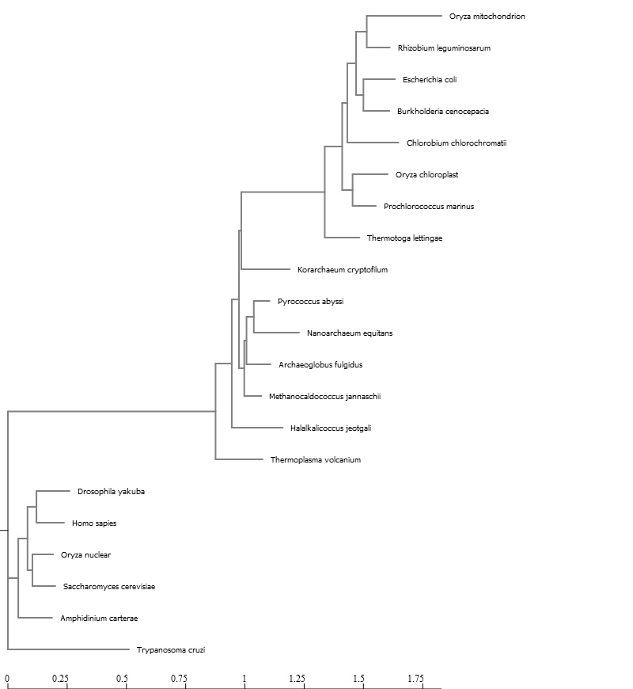

https://jeffreyblanchard.github.io/EvoGeno/EvoGeno_Lab8_phylogenetic.html#sequence-alignment-background

## Sequence Alignment Background

Sequence Alignment is one of the most fundamental operations of bioinformatics. Sequence alignments are used to decide if genes or proteins are related functionally, structurally and evolutionarily. It is also at the core of sequence search methods such as BLAST.

There are two principal methods of pair-wise sequence alignment

Dot matrix analysis.
The dynamic programming (or DP) algorithm.
Word or k-tuple methods (such as those used in BLAST and FASTA - which we will discuss later)

### Dot matrix analysis

This method involves constructing a matrix with one of the sequences to be compared running horizontally across the bottom, and the other running vertically along the left-hand side. Each entry of the matrix is a measure of similarity of those two residues on the horizontal and vertical sequence. The simplest scoring system, distinguishes only between identical (dots) and non-identical (blank) residues.

The dot plot displays graphically any possible sequence alignments as diagonals on the matrix. Insertions, deletions, direct repeats and inverted repeats can be visually detected on a dot plot. Dot plot can also detect regions of RNA that are self-complementary and thus might form secondary structure.

### The dynamic programming algorithm

“Dynamic programming was formalized by mathematician Richard Bellman, who was working at RNAD corporation on optimal decision processes. He wanted to concoct an impressive name that would shield his work from US Secretary of Defense Charles Wilson, a man know to be hostile to mathematics research. His work involved times series and planning - thus ‘dynamic’ and ‘programming’ (note, nothing particularly to do with computer programming). Bellman especially liked ‘dynamic’ because”it’s impossible to use the work dynamic in the pejorative sense“; he figured dynamic programming was”something not even a Congressman could object to" (Bellman 1984)." (Eddy 2004)

The dynamic programming algorithm is at the heart of many bioinformatics programs including BLAST (sequence searching), FASTA (sequence searching), CLUSTALW (multiple sequence alignmnet), HMMER (profile searching), GENSCAN (gene finding), MFOLD (RNA folding), and PHYLIP (phylogenetic analysis). Dynamic programing was first used for global alignment of protein sequences by Needleman and Wunnsch (1970) and to find local alignments by Smith and Waterson (1981).

### Subsitution penalties differ for particular nucleotides or aminoacids

Amino acids are put together into proteins based on their three nucleotide codons, and most mutational events usually only change one nucleotide at time. For example, starting with the Alanine codon GCU and looking at all possible changes on a http://en.wikipedia.org/wiki/Genetic_code#RNA_codon_table

Thus, from the Alanine codon GCU with a single substitution we can only get to 6 of the 19 other amino acids and 33% of the changes are going to result in keeping Alanine at the site in the protein, the other six amino acids would result 11% of the time. Even if we look at all codons for Alanine, there are still 12 amino acids that can not be made by single substitution. Thus, the frequency of changing Alanine to another amino acid by a single nucleotide change would be

### Origin of protein substitution matrices and bioinformatics

Protein substitution matrices were first developed by Margaret Dayhoff, one of the founders of the field of bioinformatics. She was particularly interested in the possibility of deducing the evolutionary relationships of organisms from protein sequences. Toward these ends she collected all the known protein sequences and, as a service to the scientific community, made them available to others in 1965 in a small book, the first Atlas of Protein Sequence and Structure.

Ref: http://en.wikipedia.org/wiki/Margaret_Oakley_Dayhoff

From these sequences, she and her coworkers developed a model of protein evolution which resulted in the development of a set of widely used substitution matrices. These are frequently called Dayhoff or PAM (Percent Accepted Mutation) matrices and similar matrices are used in many areas of bioinformatics including: sequence similarity searches (e.g. BLAST), multiple sequence alignment tools (e.g ClustalW), phylogenetics and identifying functional regions of proteins.

### Natural selection governs which amino acid changes are observed

Just like mutation mucks with the frequency matrix so does Natural Selection. Changes that occur between amino acids that have different biochemical properties are likely to affect the function of the protein. Therefore, a substitution is more likely to occur between amino acids with similar biochemical properties. In the above example with the Alanine codon a substitution that yields an amino acid change would result in mostly changes to other neutral amino acids, whereas the frequency of change to Aspartic Acid would probably be much lower. Amazingly, the genetic code has evolved to minimize changes between amino acids with different biochemical properties.

### Accounting for multiple substitutions

As time goes on and sequence divergence gets larger it gets harder to account for multiple substitutions at the same amino acid position. PAM protein matrices are based on global alignments of closely related proteins. However, sequence changes over long evolutionary time scales are not well approximated by compounding small changes that occur over short time scales. For comparing more distantly related sequence other types of matrices are used. One of the most common is the The BLOSUM (BLOck SUbstitution Matrix) series of matrices created by Steve Henikoff and colleagues. Both the PAM and BLOSUM are not expressed as transformation frequencies but the probabilities of transformation are expressed by log-odds scores as shown below for a BLOSUM62 matrix.

Ref: http://en.wikipedia.org/wiki/Substitution_matrix

### Multiple Sequence Alignment

Why is multiple seqence alignment difficult?

If sequences are all the same length, alignment is trivial:

    KNMITGAAQMDGAILVVAATDGPMPQTREHVLLARQVEVP
    KNMITGAAQMDGAILVVSATDGAMPQTKEHILLARQVGVP
    KNMITGAAQMDGAILVVSATDGAMPQTKEHILLARQVGVP
    KNMITGAAQMDGAILVVSAADGPMPQTREHILLARQVGVP

This sequence alignment is unambiguous because there is no length variation among the sequences. No indels are needed to make the alignment, and the ungapped sequences can simply be arranged together. However, if the sequenes are of various lengths, problem is more complex, potentially very complex:

    RGSALKAVEAPNDPNHEA......YKPIQELLDAMDN.....YIPDPQRDVDKPFL
    RGSALKALEGDAAYIEKVR..........ELMQAVDD.....NIPTPEREIDKPFL
    RGSALKALE.....IEKVR..........ELMQAGDAAYVDDNIPTPEREIDKPFL
    RGSALLALEEMHKNPKTKRGENEWVDKIWELLDAIDE.....YIPTPVRDVDKPFL
    RGSALLALEQMHRNPKTRRGENEWVDKIWELLDAIDE.....YIPTPVRDVDKPFL
    KGSALQALEALQANPKTARGEDKWVDRIWELLDAVDS.....YIPTPERATDKTFL
    RGTARNALESPSKDIN....APEY.KCILELMNAVDE.....YIPTPQRAVDQPFL
    KGSALQALE....NAE....DEEKTKCIWELLQAMDD.....YIPAPERDIDKPFL
    KGSAFGAMS....NPE....DPESTKCVKELLESMDN.....YFDLPERDIDKPFL
    RGSAFAAMS....KPD....DPAATKCLDELLDTMDK.....YFVIPERALDKPFL

In many cases the best position to place an indel is ambiguous. Ideally, one would know the phylogeny for the sequences; this would help infer the sequence of indels. Unfortunately one normally needs a multiple sequence alignment to make inferences about how the sequences are related. Most alignment algorithms make a quick approximation of phylogeny, and then base alignments on these. Sound circular? You are right and this is a challenging problem that is at the forefront of research in phylogenetics…the joint estimation of the alignment and phylogeny. For this class we will stick to the traditional method of first aligning sequences followed by phylogenetic analysis.

Progressive alignment methods are efficient enough to implement on a large scale for many (100s to 1000s) sequences. Progressive alignment services are commonly available on publicly accessible web servers so users need not locally install the applications of interest. The most popular progressive alignment method has been the Clustal family Different portals or implementations can vary in user interface and make different parameters accessible to the user. Clustal Omega is used extensively for phylogenetic tree construction.

The basic steps in Clustal are:

1. Calculate all possible pairwise alignments, record the score for each pair
2. Calculate a guide tree based on the pairwise distances (algorithm: Neighbor Joining)
3. Find the two most closely related sequences
4. Align these sequences (algorithm: Smith-Waterman).
  a. Calculate a consensus of this alignment
  b. Replace the two sequences with the consensus
  c. Find the two next-most closely related sequences (one of these could be a previously determined consensus sequence).
  d. Iterate until all sequences have been aligned
5. Expand the consensus sequences with the (gapped) original sequences
6. Report the multiple sequence alignment

### Software for sequence alignment

There are many tools available for sequence alignment. The common tools are hosting at the European Bioinformatics Institute.

  Pairwise sequence alignment http://www.ebi.ac.uk/Tools/psa/
  Multiple sequence alignment http://www.ebi.ac.uk/Tools/msa/
The most commonly used are Clustal, Muscle and MAFFT. MAFFT is commonly implemented for working with large data sets and where speed is important (e.g. web servers)

## Phylogenetic analysis

Phylogenetic analysis will be introduced through a set of slides for the lab. From a practical perspective, phylogenetic analysis is broken up into methods related to tree building and tree visualization.

### Phylogenetic analysis example data set

Carl Woese sequenced isolated and sequenced ribosomal RNA to discover a new domain of life, the Archaea. The method he used for directly sequencing RNA was very laborious as shown in the segment of Intimate Strangers: The Puzzle". His discovery was dependent on using phylogenetic methods to determine the relationship of his microbial sequence to other sequences in the database. Since his discovery, progress sequencing specfic genes from genomic DNA has greatly simplified the process of understanding microbial phylogenies. In this project you will be given a DNA sequence, then construct a multiple sequence alignment and do a phylogenetic analysis to show the relationships among the taxa represented by the DNA sequences.

I have assembled a core group DNA sequences of small subunit ribosomal gene from our national DNA database Genbank to provide an example on the Moodle site - Tree_of_Life_Core_Sequences.txt. Download this to your computer. The files contains data for the following species.

  Thermoplasma volcanium
  Halalkalicoccus jeotgali
  Candidatus Korarchaeum cryptofilum
  Nanoarchaeum equitans
  Chlorobium chlorochromatii
  Burkholderia cenocepacia
  Rhizobium leguminosarum
  Escherichia coli
  Archaeoglobus fulgidus
  Methanocaldococcus jannaschii
  Pyrococcus abyssi
  Oryza sativa nuclear
  Oryza sativa mitochondrion
  Oryza sativa chloroplast
  Saccharomyces cerevisiae nuclear
  Homo sapies nuclear
  Drosophila yakuba nuclear
  Amphidinium carterae nuclear
  Thermotoga lettingae
  Prochlorococcus marinus
  Trypanosoma cruzi

If you need to know more about an organism you can check out the NCBI genome project site (e.g. Nanoarchaeum equitans genome project site http://www.ncbi.nlm.nih.gov/bioproject/35283) or Wikipedia for what is usually a good summary Nanoarchaeum equitans http://en.wikipedia.org/wiki/Nanoarchaeum_equitans. Next download the file Tree_of_Life_Core_Sequences.txt.

### NGPhylogeny.fr - A quick and easy working flow including multiple sequence alignment, phylogenetic analysis and tree visualization

This web server is great place to learn the basic workflow for phylogenetic analysis and I use it on occasion when I just need a quick see of the relationships among a small set of sequences. Doing a phylogenetic analysis involves (1) assembling a group of sequences to evaluate, (2) aligning the sequences so that a distance can be calculate between the sequences, (3) determining the relationships among the sequences, and (4) visualizing the relationships. Step 1 was accomplished above by getting representative archaeal, bacterial and eukaryotic sequences from GenBank. Steps 2-4 will be done on web server that has been set up to run these steps at the same time. Go to the site for Robust Phylogenetic Analysis For The Non-Specialist https://ngphylogeny.fr/. Scroll down and under Phylogenetic Analysis select “One Click”. Upload or paste in your DNA sequences from the file in Moodle. Then click submit. This will start the analysis process. The numbers of the tree represent statistical support for the relationship. The more robust the relationship the closer the value will be to 1. The scale at the bottom represents sequence distance (e.g. 0.2 is 20%).

Save you tree as a png file to your computer. This will allow you to upload into your .Rmd file. Also save your tree as a newick file for later use.

There are other one stop shops for phylogenetic analysis including NCBI’s Genome Workbench https://www.ncbi.nlm.nih.gov/tools/gbench/, MEGA https://megasoftware.net/ and the commercial software Genious https://www.geneious.com/. Because working with medium or large (hundreds to thousands) sequence data sets requires greater computational resources, it is often most praticial to run multiple sequence alignment and phylogenetic analyses on high performance computers. Using a Unix-based HPC also allows for access to a greater variety and the newest phylogenetic methods.

### Phylogenetic Analysis (tree building) on CIPRES

The CIPRES Science Gateway is a public resource for inference of large phylogenetic trees. It is designed to provide researchers with access to large computational resources of the NSF TeraGrid through a simple browser interface. The CIPRES Science Gateway The CIPRES Portal V 1.0 permitted users to run popular sequence alignment tools ClustalW, Muscle and MAFFT and the community tree inference tools FasttreeML, GARLI, RAxML, PAUP, and MrBayes.

Last night on my computer the CIPRES Tutorial http://www.phylo.org/tools/flash/cipresportal2_data_management.htm . was not working, but maybe it will work today or in your web browser. Also at the moment I am not getting the right format for the output of GBlocks I will go through this in lab. Here is my step by step tutorial on using CIPRES https://jeffreyblanchard.github.io/EvoGeno/EvoGeno_CIPRES_tutorial.html

### Phylogenetic tree visualization

The tree visualizations on NGPhylogeny.fr are ok for some purposes, but often for publications more tree editing and visualization features are needed. There are a number of packages available to bring trees to like including Figtree http://tree.bio.ed.ac.uk/software/figtree/ , Dendroscope https://www.wsi.uni-tuebingen.de/lehrstuehle/algorithms-in-bioinformatics/software/dendroscope/ and iTOL https://itol.embl.de/ . ETE Toolkit http://etetoolkit.org/ is a framework for analyzing and visualizing trees in Python. For a more complete list see Wikipedia https://en.wikipedia.org/wiki/List_of_phylogenetic_tree_visualization_software.

Historically most phylogenetic analysis and tree visualization has been done with independent software tools. There has been a growing move towards using R for phylogenetic analyses. The package ape: Analysis of Phylogenetics and Evolution https://rdrr.io/cran/ape/ can access popular multiple sequence alignment and phylogenetic analysis methods. ggtree https://bioconductor.org/packages/release/bioc/html/ggtree.html extends the ‘ggplot2’ for visualization and annotation of phylogenetic trees with their annotation data. The author, Guangchuang Yu, has recently published an R book Data Integration, Manipulation and Visualization of Phylogenetic Trees. https://yulab-smu.top/treedata-book/

## Exercises

1. Use NGPhylogeny.fr to analysis the set of rRNA sequence provided. Describe the methods and put the .png file from your analysis into your Lab 8 .Rmd file



2. Align and do phylogenetic analysis off the sequences in CIPRES using MAFFT and FastTreeMP. Here https://jeffreyblanchard.github.io/EvoGeno/EvoGeno_CIPRES_tutorial.html is my step by step tutorial on using CIPRES. You will need to click on Parameter Set and Save even if you don’t change the parameters. Download the fastree_result.tre to your computer.

3. Go through the tutorial on Visualizing and Annotating Phylogenetic Trees with R+ggtree https://jeffreyblanchard.github.io/EvoGeno/ggtree_tutorial.html adding the steps to your .Rmd file.

#### ggtree tutorial

gtree is an R package that extends ggplot2 for visualizating and annotating phylogenetic trees with their covariates and other associated data. It is available from Bioconductor http://www.bioconductor.org/. Bioconductor is a project to provide tools for analyzing and annotating various kinds of genomic data. You can search and browse Bioconductor packages here http://www.bioconductor.org/packages/release/BiocViews.html#___Software .

1. ggtree Bioconductor page: bioconductor.org/packages/ggtree.
2. ggtree homepage: guangchuangyu.github.io/ggtree (contains more information about the package, more documentation, a gallery of beautiful images, and links to related resources).
3. ggtree publication: Yu, Guangchuang, et al. “ggtree: an r package for visualization and annotation of phylogenetic trees with their covariates and other associated data.” Methods in Ecology and Evolution (2016) DOI:10.1111/2041-210X.12628.

Bioconductor packages usually have great documentation in the form of vignettes. Take a look at the landing page for ggtree http://bioconductor.org/packages/release/bioc/html/ggtree.html – about halfway down the page under the “Documentation” heading there are multiple walkthrough tutorials directed to different applications and functionalities of ggtree, chock full of runnable examples and explanations.

Just like R packages from CRAN, you only need to install Bioconductor packages once (instructions here), then load them every time you start a new R session. Load the tidyverse package first.

```{r}
library(tidyverse)
library(ggtree)
library(treeio)
library(ggimage)
```

A note on masked functions: Take a second and look through some of the output that you see when you load ggtree after tidyverse. When you first installed ggtree it may have taken a while, because ggtree depends on a number of other R packages. Each of these, in turn, may depend on other packages. These are all loaded into your working environment when you load ggtree. Also notice the lines that start with The following objects are masked from 'package:.... One example of this is the collapse() function from dplyr. When ggtree was loaded, it loaded it’s own function called collapse(). Now, if you wanted to use dplyr’s collapse function, you’ll have to call it explicitly using this kind of syntax: dplyr::collapse(). See this Q&A thread for more. http://stackoverflow.com/questions/4879377/r-masked-functions

##### Tree Import

From the ggtree landing page http://bioconductor.org/packages/release/bioc/html/ggtree.html take a look at the Tree Data Import vignette http://bioconductor.org/packages/release/bioc/vignettes/ggtree/inst/doc/treeImport.html. There are many different software packages for creating phylogenetic trees from different types of data, and there are many formats for storing the resulting phylogenetic trees they produce.

Most tree viewer software (including R packages) focus on Newick and Nexus file formats, and other evolution analysis software might also contain supporting evidence within the file that are ready for annotating a phylogenetic tree. ggtree supports several file formats

The ggtree package implement several parser functions, including:

read.tree for reading Newick files.
read.phylip for reading Phylip files.
read.jplace for reading Jplace files.
read.nhx for reading NHX files.
read.beast for parsing output of BEAST
read.codeml for parsing output of CODEML (rst and mlc files)
read.codeml_mlc for parsing mlc file (output of CODEML)
read.hyphy for parsing output of HYPHY
read.jplace for parsing jplace file including output from EPA and pplacer
read.nhx for parsing NHX file including output from PHYLODOG and RevBayes
read.paml_rst for parsing rst file (output of BASEML and CODEML)
read.r8s for parsing output of r8s
read.raxml for parsing output of RAxML

##### Basic trees

Let’s first import our tree data. We’re going to work with a made-up phylogeny with 13 samples (“tips”). Download the tree_newick.nwk data https://jeffreyblanchard.github.io/EvoGeno/data/tree_newick.nwk by clicking here or using the link above. Let’s load the libraries you’ll need if you haven’t already, and then import the tree using read.tree(). Displaying the object itself really isn’t useful. The output just tells you a little bit about the tree itself.

```{r}
library(tidyverse)
library(ggtree)
tree <- read.tree("data/tree_newick.nwk")
tree
```

Just like with ggplot2 we created a basic canvas with ggplot(...) and added layers with +geom_???(), we can do the same here. The ggtree package gives us a geom_tree() function. Because ggtree is built on top of ggplot2, you get ggplot2’s default gray theme with white lines. You can override this with a theme from the ggtree package.

Because you’ll almost always want to add a tree geom and remove the default background and axes, the ggtree() function is essentially a shortcut for ggplot(...) + geom_tree() + theme_tree().

```{r}
# build a ggplot with a geom_tree
ggplot(tree) + geom_tree() + theme_tree()
# This is convenient shorthand
ggtree(tree)
```

There’s also the treescale geom, which adds a scale bar, or alternatively, you can change the default ggtree() theme to theme_tree2(), which adds a scale on the x-axis. The horizontal dimension in this plot shows the amount of genetic change, and the branches and represent evolutionary lineages changing over time. The longer the branch in the horizonal dimension, the larger the amount of change, and the scale tells you this. The units of branch length are usually nucleotide substitutions per site – that is, the number of changes or substitutions divided by the length of the sequence (alternatively, it could represent the percent change, i.e., the number of changes per 100 bases). See this article for more. http://epidemic.bio.ed.ac.uk/how_to_read_a_phylogeny

```{r}
# add a scale
ggtree(tree) + geom_treescale()
# or add the entire scale to the x axis with theme_tree2()
ggtree(tree) + theme_tree2()
```

The default is to plot a phylogram, where the x-axis shows the genetic change / evolutionary distance. If you want to disable scaling and produce a cladogram instead, set the branch.length="none" option inside the ggtree() call. See ?ggtree for more.

```{r}
ggtree(tree, branch.length="none")
```

The ... option in the help for ?ggtree represents additional options that are further passed to ggplot(). You can use this to change aesthetics of the plot. Let’s draw a cladogram (no branch scaling) using thick blue dotted lines (note that I’m not mapping these aesthetics to features of the data with aes() – we’ll get to that later).

```{r}
ggtree(tree, branch.length="none", color="blue", size=2, linetype=3)
```

#### Exercise 1

Look at the help again for ?ggtree, specifically at the layout= option. By default, it produces a rectangular layout.

Create a slanted phylogenetic tree.

```{r}
ggtree(tree, layout="slanted")
```

Create a circular phylogenetic tree.

```{r}
ggtree(tree, layout="circular")
```

Create a circular unscaled cladogram with thick red lines.

```{r}
ggtree(tree, branch.length="none", color="red", layout="circular")
```

### Other tree geoms

Let’s add additional layers. As we did in the ggplot2 lesson, we can create a plot object, e.g., p, to store the basic layout of a ggplot, and add more layers to it as we desire. Let’s add node and tip points. Let’s finally label the tips.

```{r}
# create the basic plot
p <- ggtree(tree)
# add node points
p + geom_nodepoint()
# add tip points
p + geom_tippoint()
# Label the tips
p + geom_tiplab()
```

#### Exercise 2

Similar to how we change the aesthetics for the tree inside the ggtree() call, we can also change the aesthetics of the points themselves by passing graphical parameters inside the geom_nodepoint() or geom_tippoint() calls. Create a phylogeny with the following aesthetic characteristics:

1. tips labeled in purple

```{r}
p <- ggtree(tree)
p + geom_tiplab(color="purple")
```

2. purple-colored diamond-shape tip points (hint: Google search “R point characters”)

```{r}
p <- ggtree(tree)
p + geom_tippoint(color="purple", pch=5)
```

3. large semitransparent yellow node points (hint: alpha=)

```{r}
p <- ggtree(tree)
p + geom_nodepoint(color="purple", alpha= 0.5)
```

4. Add a title with + ggtitle(...)

```{r}
p <- ggtree(tree)
p + ggtitle("Title")

```

### Tree annotation

The geom_tiplab() function adds some very rudimentary annotation. Let’s take annotation a bit further. See the tree annotation and advanced tree annotation vignettes for more. http://bioconductor.org/packages/release/bioc/vignettes/ggtree/inst/doc/treeAnnotation.html http://bioconductor.org/packages/release/bioc/vignettes/ggtree/inst/doc/advanceTreeAnnotation.html

#### Internal node number

Before we can go further we need to understand how ggtree is handling the tree structure internally. Some of the functions in ggtree for annotating clades need a parameter specifying the internal node number. To get the internal node number, user can use geom_text to display it, where the label is an aesthetic mapping to the “node variable” stored inside the tree object (think of this like the continent variable inside the gapminder object). We also supply the hjust option so that the labels aren’t sitting right on top of the nodes. Read more about this process in the ggtree manipulation vignette. http://bioconductor.org/packages/release/bioc/vignettes/ggtree/inst/doc/treeManipulation.html#internal-node-number

```{r}
ggtree(tree) + geom_text(aes(label=node), hjust=-.3)
```

Another way to get the internal node number is using MRCA() function by providing a vector of taxa names (created using c("taxon1", "taxon2")).. The function will return node number of input taxa’s most recent commond ancestor (MRCA). First, re-create the plot so you can choose which taxa you want to grab the MRCA from.

```{r}
ggtree(tree) + geom_tiplab()
```

Let’s grab the most recent common ancestor for taxa C+E, and taxa G+H. We can use MRCA() to get the internal node numbers. Go back to the node-labeled plot from before to confirm this.

```{r}
MRCA(tree, c("C", "E"))
```

```{r}
MRCA(tree, c("G", "H"))
```

```{r}
# MRCA(tree, tip=c("C", "E"))
# MRCA(tree, tip=c("G", "H"))
```

#### Labeling clades

We can use geom_cladelabel() to add another geom layer to annotate a selected clade with a bar indicating the clade with a corresponding label. You select the clades using the internal node number for the node that connects all the taxa in that clade. See the tree annotation vignette for more. http://bioconductor.org/packages/release/bioc/vignettes/ggtree/inst/doc/treeAnnotation.html#annotate-clades

Let’s annotate the clade with the most recent common ancestor between taxa C and E (internal node 17). Let’s make the annotation red. See ?geom_cladelabel help for more.

```{r}
ggtree(tree) + 
  geom_cladelabel(node=17, label="Some random clade", color="red")
```

Let’s add back in the tip labels. Notice how now the clade label is too close to the tip labels. Let’s add an offset to adjust the position. You might have to fiddle with this number to get it looking right.

```{r}
ggtree(tree) + 
  geom_tiplab() + 
  geom_cladelabel(node=17, label="Some random clade", 
                  color="red2", offset=.8)
```

Now let’s add another label for the clade connecting taxa G and H (internal node 21).

```{r}
ggtree(tree) + 
  geom_tiplab() + 
  geom_cladelabel(node=17, label="Some random clade", 
                  color="red2", offset=.8) + 
  geom_cladelabel(node=21, label="A different clade", 
                  color="blue", offset=.8)
```

Uh oh. Now we have two problems. First, the labels would look better if they were aligned. That’s simple. Pass align=TRUE to geom_cladelabel() (see ?geom_cladelabel help for more). But now, the labels are falling off the edge of the plot. That’s because geom_cladelabel() is just adding it this layer onto the end of the existing canvas that was originally layed out in the ggtree call. This default layout tried to optimize by plotting the entire tree over the entire region of the plot. Here’s how we’ll fix this.

1. First create the generic layout of the plot with ggtree(tree).
2. Add some tip labels.
3. Add each clade label.
4. Remember theme_tree2()? We used it way back to add a scale to the x-axis showing the genetic distance. This is the unit of the x-axis. We need to set the limits on the x-axis. Google around for something like “ggplot2 x axis limits” and you’ll wind up on this StackOverflow page that tells you exactly how to solve it – just add on a + xlim(..., ...) layer. Here let’s extend out the axis a bit further to the right.
5. Finally, if we want, we can either comment out the theme_tree2() segment of the code, or we could just add another theme layer on top of the plot altogether, which will override the theme that was set before. theme_tree() doesn’t have the scale.

```{r}
ggtree(tree) + 
  geom_tiplab() + 
  geom_cladelabel(node=17, label="Some random clade", 
                  color="red2", offset=.8, align=TRUE) + 
  geom_cladelabel(node=21, label="A different clade", 
                  color="blue", offset=.8, align=TRUE) + 
  theme_tree2() + 
  xlim(0, 70) + 
  theme_tree()
```

Alternatively, we could highlight the entire clade with geom_hilight(). See the help for options to tweak.

```{r}
ggtree(tree) + 
  geom_tiplab() + 
  geom_hilight(node=17, fill="gold") + 
  geom_hilight(node=21, fill="purple")
```

#### Connecting taxa

Some evolutionary events (e.g. reassortment, horizontal gene transfer) can be visualized with some simple annotations on a tree. The geom_taxalink() layer draws straight or curved lines between any of two nodes in the tree, allow it to show evolutionary events by connecting taxa. Take a look at the tree annotation vignette and ?geom_taxalink for more.

```{r}
ggtree(tree) + 
  geom_tiplab() + 
  geom_taxalink("E", "H", color="blue3") +
  geom_taxalink("C", "G", color="orange2", curvature=-.9)
```

#### Exercise 3

Produce the figure below.

1. First, find what the MRCA is for taxa B+C, and taxa L+J. You can do this in one of two ways:
  a. Easiest: use MRCA(tree, tip=c("taxon1", "taxon2")) for B/C and L/J separately.
  b. Alternatively: use ggtree(tree) + geom_text(aes(label=node), hjust=-.3) to see what the node labels are on the plot. You might also add tip labels here too.
2. Draw the tree with ggtree(tree).
3. Add tip labels.
4. Highlight these clades with separate colors.
5. Add a clade label to the larger superclade (node=17) that we saw before that includes A, B, C, D, and E. You’ll probably need an offset to get this looking right.
6. Link taxa C to E, and G to J with a dashed gray line (hint: get the geom working first, then try changing the aesthetics. You’ll need linetype=2 somewhere in the geom_taxalink()).
7. Add a scale bar to the bottom by changing the theme.
8. Add a title.
9. Optionally, go back to the original ggtree(tree, ...) call and change the layout to "circular".

```{r}
MRCA(tree, c("B", "C"))
```
```{r}
MRCA(tree, c("L", "J"))
```

```{r}
ggtree(tree) + 
  geom_tiplab() + 
 geom_cladelabel(node=17, label="Supeclade 17", 
                  color="red2", offset=.8, align=TRUE) + 
  geom_hilight(node=23, fill="gold") + 
  geom_hilight(node=19, fill="purple") +
  theme_tree2() + 
  xlim(0, 70) + 
  theme_tree() +
  geom_taxalink("C", "E", linetype=2) +
  geom_taxalink("G", "J", linetype=2)+ 
  theme_tree2() +
  ggtitle("Title")
```

### Advanced tree annotation

Let’s use a previously published dataset from this paper:

Liang et al. “Expansion of genotypic diversity and establishment of 2009 H1N1 pandemic-origin internal genes in pigs in China.” Journal of virology (2014): 88(18):10864-74.

This data was reanalyzed in the ggtree paper.

The subset of the data used here contains 76 H3 hemagglutinin gene sequences of a lineage containing both swine and human influenza A viruses. The sequence data set was re-analyzed by using BEAST (available at http://beast.bio.ed.ac.uk/). BEAST (Bayesian Evolutionary Analysis Sampling Trees) can give you rooted, time-measured phylogenies inferred using molecular clock models.

For this you’ll need the flu_tree_beast.tree output file from BEAST and the flu_aasequence.fasta FASTA file with the multiple sequence alignment. These are both available on the data downloads page(https://4va.github.io/biodatasci/data.html). First let’s read in the tree with read.beast() (instead of the read.tree() we used before). Let’s add a scale bar with theme_tree2(). This gives you genetic distance. But, we have time measured here with molecular clock models. We’ve only estimated the relative time between branching events, so if we want to actually see dates on the x-axis, we need to supply the most recent sampling date to the ggtree() call. Do this by setting mrsd="YYYY-MM-DD" inside ggtree().

Finally, let’s add some tip labels. We’ll want to right-align them, and by default the dotted line is a little too thick. Let’s reduce the linesize a bit. Now, some of the labels might be falling off the margin. Set the xlim to limit the axis to show between 1990 and 2020. You could get MRCAs and node numbers and do all the annotations that we did before the same way here.

```{r}
# Read the data
tree <- read.beast("data/flu_tree_beast.tree")
# supply a most recent sampling date so you get the dates
# and add a scale bar
ggtree(tree, mrsd="2013-01-01") + 
  theme_tree2() 
# Finally, add tip labels and adjust axis
ggtree(tree, mrsd="2013-01-01") + 
  theme_tree2() + 
  geom_tiplab(align=TRUE, linesize=.5) + 
  xlim(1990, 2020)
```

Finally, let’s look at ?msaplot. This puts the multiple sequence alignment and the tree side-by-side. The function takes a tree object (produced with ggtree()) and the path to the FASTA multiple sequence alignment. You can do it with the entire MSA, or you could restrict to just a window. Want something interesting-looking, but maybe not all that useful? Try changing the coordinate system of the plot itself by passing + coord_polar(theta="y") to the end of the command!

```{r}
msaplot(p=ggtree(tree), fasta="data/flu_aasequence.fasta", window=c(150, 175))
```

```{r}
msaplot(p=ggtree(tree), fasta="data/flu_aasequence.fasta", window=c(150, 175)) + coord_polar(theta="y")
```

Take a look at the advanced tree annotation vignette for much, much more! http://bioconductor.org/packages/release/bioc/vignettes/ggtree/inst/doc/advanceTreeAnnotation.html

### Bonus!

See the ggtree vignettes for more details on how these work. http://bioconductor.org/packages/release/bioc/html/ggtree.html

#### Many trees

ggtree will let you plot many trees at once, and you can facet them the normal ggplot2 way. Let’s generate 3 replicates each of 4 random trees with 10, 25, 50, and 100 tips, plotting them all.

```{r}
set.seed(42)
trees <- lapply(rep(c(10, 25, 50, 100), 3), rtree)
class(trees) <- "multiPhylo"
ggtree(trees) + facet_wrap(~.id, scale="free", ncol=4) + ggtitle("Many trees. Such phylogenetics. Wow.")
```

#### Plot tree with other data

For showing a phylogenetic tree alongside other panels with your own data, the facet_plot() function accepts a input data.frame and a geom function to draw the input data.

```{r}
# Generate a random tree with 30 tips
tree <- rtree(30)
# Make the original plot
p <- ggtree(tree)
# generate some random values for each tip label in the data
d1 <- data.frame(id=tree$tip.label, val=rnorm(30, sd=3))
# Make a second plot with the original, naming the new plot "dot", 
# using the data you just created, with a point geom.
p2 <- facet_plot(p, panel="dot", data=d1, geom=geom_point, aes(x=val), color='red3')
# Make some more data with another random value.
d2 <- data.frame(id=tree$tip.label, value = abs(rnorm(30, mean=100, sd=50)))
# Now add to that second plot, this time using the new d2 data above, 
# This time showing a bar segment, size 3, colored blue.
p3 <- facet_plot(p2, panel='bar', data=d2, geom=geom_segment, 
           aes(x=0, xend=value, y=y, yend=y), size=3, color='blue4') 
# Show all three plots with a scale
 p3 + theme_tree2()
```

#### Overlay organism silouhettes

phylopic.org (http://phylopic.org/) hosts free silhouette images of animals, plants, and other life forms, all under Creative Commons or Public Domain. You can use ggtree to overlay a phylopic image on your plot at a node of your choosing.

```{r}
# get phylopic 

newick <- "((Pongo_abelii,(Gorilla_gorilla_gorilla,(Pan_paniscus,Pan_troglodytes)Pan,Homo_sapiens)Homininae)Hominidae,Nomascus_leucogenys)Hominoidea;"

tree <- read.tree(text=newick)

d <- ggimage::phylopic_uid(tree$tip.label)
d$body_mass = c(52, 114, 47, 45, 58, 6)

p <- ggtree(tree) %<+% d + 
  geom_tiplab(aes(image=uid, colour=body_mass), geom="phylopic", offset=2.5) +
  geom_tiplab(aes(label=label), offset = .2) + xlim(NA, 7) +
  scale_color_viridis_c()
p  
```

4. Upload your tree file from the FastTreeMP output on CIPRES into R using treeio. Using ggtree to make the tree images, coloring the tree according to the domains of life.

```{r}
tree <- read.tree("data/TOL_fastree_result.tre")
tree
```
```{r}
ggtree(tree, branch.length="none",layout="circular") + geom_text(aes(label=node), hjust=-.3)
```

```{r}
ggtree(tree) + geom_text(aes(label=node), hjust=-.3)
```


```{r}
ggtree(tree)  + 
  theme_tree2() + 
  geom_tiplab(hjust=-.1, size = 3) +
  geom_hilight(node=30, fill="red") + 
  geom_hilight(node=25, fill="gold") +
  geom_hilight(node=16, fill="blue") + 
  geom_hilight(node=39, fill="green") +
  geom_hilight(node=38, fill="purple") + 
  geom_hilight(node=1, fill="yellow") + 
  xlim(0,2)
```

```{r}
ggtree(tree, branch.length="none", layout="circular")  + 
  theme_tree2() + 
  geom_tiplab(hjust=-.1, size = 3) +
  geom_hilight(node=30, fill="red") + 
  geom_hilight(node=25, fill="gold") +
  geom_hilight(node=16, fill="blue") + 
  geom_hilight(node=39, fill="green") +
  geom_hilight(node=38, fill="purple") + 
  geom_hilight(node=1, fill="yellow") + 
  xlim(0, 36)
```

If you the tree is not fitting in the plot space you can modify the xlim

```{r}
# Add to your 
#ggtree(tree) +
  #xlim(0,2) # This worked from my rectangular trees
  #xlim(0.36) # This worked for my circular trees
```

To show the bootstrap values

```{r}
#ggtree(tree) +  
#  geom_nodelab()
```

To change text size and position

```{r}
#ggtree(tree) +
#  geom_tiplab(hjust=-.1, size = 3)
```

To change the size of the highlighted clade you can use extend

```{r}
#ggtree(tree) +
#  geom_hilight(node=34, fill="gold", extend = 0.5) 
```

